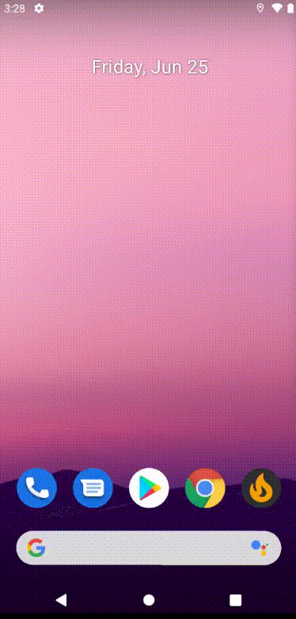

Firebase Stack
===================
*(underway)*

The demo application making the most of Firebase

### Architecture
* [Guide to app architecture](https://developer.android.com/jetpack/guide) - MVVM
* [Kotlin](https://kotlinlang.org/) - 100%
* [Jetpack Compose](https://developer.android.com/jetpack/compose)
* [Android 12](https://developer.android.com/about/versions/12?authuser=1)

### Firebase Stack
* [Firebase Authentication](https://firebase.google.com/docs/auth)
* [Firebase Realtime Database](https://firebase.google.com/docs/database)
* [Cloud Storage for Firebase](https://firebase.google.com/docs/storage)
* [Firebase Crashlytics](https://firebase.google.com/docs/crashlytics)
* [Firebase Performance Monitoring](https://firebase.google.com/docs/perf-mon)
* [Google Analytics](https://firebase.google.com/docs/analytics)
* [Firebase Remote Config](https://firebase.google.com/docs/remote-config)
* [Firebase Cloud Messaging](https://firebase.google.com/docs/cloud-messaging)
* [Firebase In-App Messaging](https://firebase.google.com/docs/in-app-messaging)
* [Firebase Dynamic Links](https://firebase.google.com/docs/dynamic-links)
* [Firebase App Distribution](https://firebase.google.com/docs/app-distribution)
* [Firebase Test Lab](https://firebase.google.com/docs/test-lab)
* [Firebase A/B Testing](https://firebase.google.com/docs/ab-testing)

### Preview
<p align="center">

</p>

# License

```
Copyright 2021 Vitaliy Zarubin

Licensed under the Apache License, Version 2.0 (the "License");
you may not use this file except in compliance with the License.
You may obtain a copy of the License at

    http://www.apache.org/licenses/LICENSE-2.0

Unless required by applicable law or agreed to in writing, software
distributed under the License is distributed on an "AS IS" BASIS,
WITHOUT WARRANTIES OR CONDITIONS OF ANY KIND, either express or implied.
See the License for the specific language governing permissions and
limitations under the License.
```